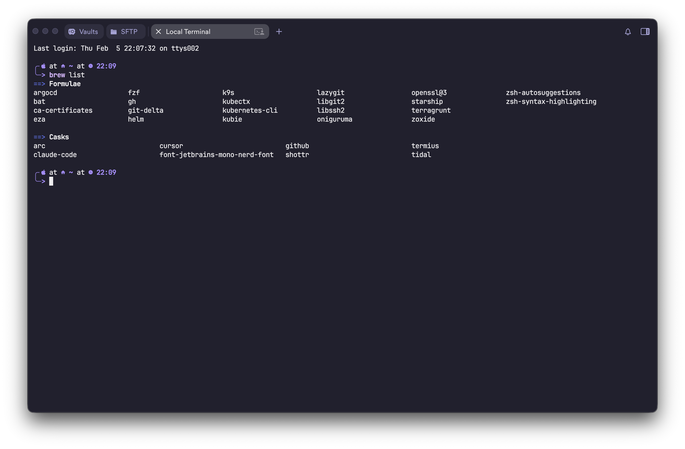

# dotfiles

My terminal configuration with a purple-themed setup.

## What's Included

| File | Description |
|------|-------------|
| `.zshrc` | Zsh config with aliases, plugins, and tool integrations |
| `.config/starship.toml` | Starship prompt with purple theme and Nerd Font icons |
| `.gitconfig` | Git config with delta for side-by-side diffs |

## Screenshot



## Prompt

Uses [Starship](https://starship.rs) with a box-drawing style and purple theme:

```
╭╴󰀵 at 󰋜 ~/project on 󰊢 main (󰸞) took 󰔛 2s at 󰥔 14:32
╰─>
```

Shows OS icon, directory, git branch/status, command duration, and time.

## Tools

| Tool | Replaces | What it does |
|------|----------|-------------|
| [eza](https://github.com/eza-community/eza) | `ls` | File listing with icons, colors, git status |
| [bat](https://github.com/sharkdp/bat) | `cat` | Syntax-highlighted file viewing |
| [delta](https://github.com/dandavella/delta) | `git diff` | Side-by-side diffs with line numbers |
| [zoxide](https://github.com/ajeetdsouza/zoxide) | `cd` | Smart directory navigation that learns your habits |
| [fzf](https://github.com/junegunn/fzf) | — | Fuzzy finder for files, history, directories |
| [lazygit](https://github.com/jesseduffield/lazygit) | — | Terminal UI for git |
| [k9s](https://github.com/derailed/k9s) | — | Terminal UI for Kubernetes |

## Zsh Plugins

- **zsh-autosuggestions** — ghost text predictions from history
- **zsh-syntax-highlighting** — colors commands as you type (valid = purple, invalid = red)

## Prerequisites

- [Homebrew](https://brew.sh)
- A [Nerd Font](https://www.nerdfonts.com) (config uses JetBrains Mono Nerd Font)

## Install

```bash
# Install tools
brew install starship eza bat git-delta zoxide fzf lazygit k9s \
  zsh-autosuggestions zsh-syntax-highlighting

# Install Nerd Font
brew install --cask font-jetbrains-mono-nerd-font

# Symlink dotfiles
ln -sf ~/dotfiles/.zshrc ~/.zshrc
ln -sf ~/dotfiles/.config/starship.toml ~/.config/starship.toml
ln -sf ~/dotfiles/.gitconfig ~/.gitconfig

# Set font in your terminal app to "JetBrainsMono Nerd Font"
# Restart your terminal
```
